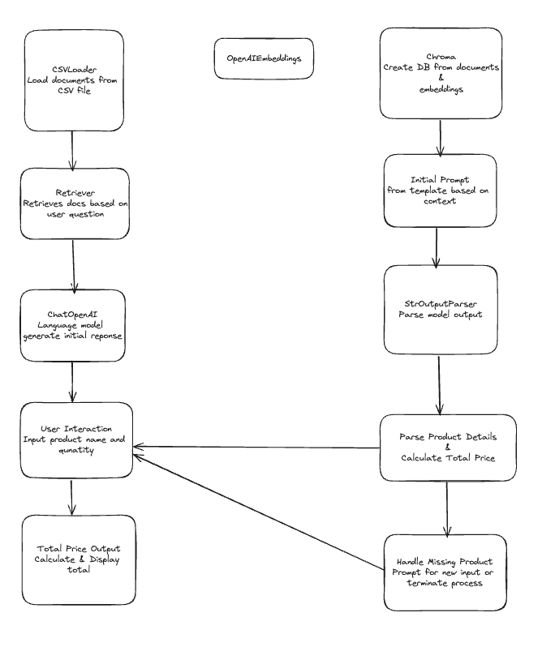

1. Motivation
keyword search 인터넷 쇼핑이 아닌, 나의 상황을 설명하고 갖고 싶은 것이 무엇인지 검색하는 Semantic search 인터넷 쇼핑
======
쇼핑도 이제 목록을 보고 구매하는 것이 아닌 프롬프트 쇼핑몰 구현을 해보고 싶었다
동기는 뭐 구글 대신 gpt를 사용하는데, 쇼핑도 프롬프트형식으로 하면 어떨까

목록을 보면서 고르는 건이 아닌.
목마른데 마실 거 사고싶어~
바로 음료수 추천

랭체인 그래프:
프롬프트 "정보가 충분하지 않으면 재질문하세요"
-> 정보 계속 받는 사이클 제작

2. Data
https://www.kaggle.com/datasets/carrie1/ecommerce-data
row: 
Description
Quantity
UnitPrice